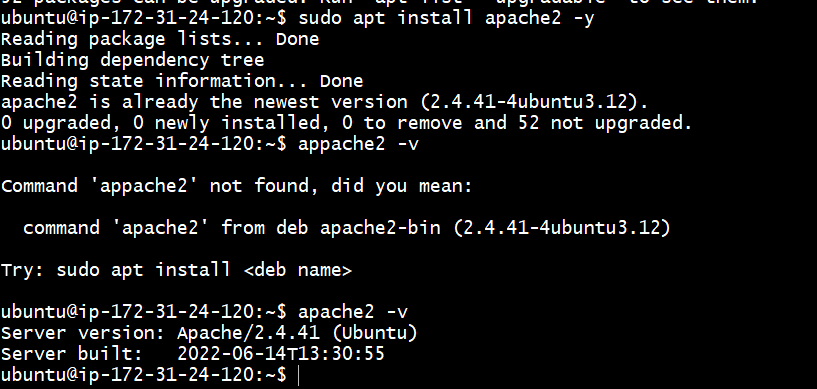

# LOAD BALANCER SOLUTION WITH APACHE

### Prerequisites
* Using the servers installed and configured within Project-7:

`1. Three RHEL8 Web Servers `

`2. One MySQL DB Server `

`3. One RHEL8 NFS server`

* Task 1 --  Deployed and configured an Apache Load Balancer for Tooling Website solution on a separate Ubuntu EC2 intance. ( Ubuntu Server 20.04 EC2) named Project-8-apache-lb

* Task 2 -- installed appache2 and configured it to point to the webservers

## Installing apache2
` sudo apt update `

` sudo apt install apache2 -y `

` sudo apt-get install libxml2-dev `

## Enabled the following modules:
` sudo a2enmod rewrite `

` sudo a2enmod proxy `

` sudo a2enmod proxy_balancer `

` sudo a2enmod proxy_http `

` sudo a2enmod headers `

` sudo a2enmod lbmethod_bytraffic `

## Restarted apache2 service 
` sudo systemctl restart apache2 ` 

` sudo systemctl status apache2 ` 

## Configured load balancing

` sudo vi /etc/apache2/sites-available/000-default.conf ` 

## Added the config below into this section (VirtualHost *:80) (VirtualHost)

    <Proxy "balancer://mycluster">
               BalancerMember http://172.31.0.203:80 loadfactor=5 timeout=1
               BalancerMember http://172.31.4.172:80 loadfactor=5 timeout=1
               BalancerMember http://172.31.2.22:80 loadfactor=5 timeout=1
               ProxySet lbmethod=bytraffic
               # ProxySet lbmethod=byrequests
        </Proxy>

        ProxyPreserveHost On
        ProxyPass / balancer://mycluster/
        ProxyPassReverse / balancer://mycluster/ 

## Restarted apache server

sudo systemctl restart apache2

## Verified all configuration works – by accessing my LB’s public IP addres from my browser:
` http://3.145.117.210/index.php ` 

` or `

` ec2-3-145-117-210.us-east-2.compute.amazonaws.com `

## umounting /var/log/http from web-1,2 and 3

### opened 3 git bash console to check the logs after refreshing the web page several times

` sudo tail -f /var/log/httpd/access_log `

